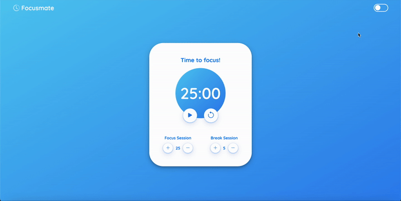

# ⏱️ Focusmate

Focusmate is a simple, elegant Pomodoro-style timer web app built with Flask. It helps users alternate between focused work sessions and short breaks. The app also includes a contact form that sends messages via email using SMTP.

🔗 **Live Demo:** [https://focusmate-6ton.onrender.com](https://focusmate-6ton.onrender.com)

## 🧠 Features

- ⏳ Adjustable focus and break sessions
- 🎵 Sound effects for timer actions
- 🌓 Light/Dark mode toggle
- ✉️ Contact form that sends messages to your inbox
- 🧠 Session lengths stored in `localStorage`
- 📱 Responsive design with clean UI using Bootstrap Icons

## 📸 Preview



## 📂 Project Structure

```
Focusmate/
│
├── app.py # Flask server and routes
├── templates/ # HTML templates (base, index, about, faq, contact)
│ └── base.html
│ └── index.html
│ └── about.html
│ └── faq.html
│ └── contact.html
├── static/
│ ├── styles.css # Custom CSS
│ ├── js/
│ │ └── main.js # Main script file
│ │ └── theme.js # Dark theme toggle logic
│ │ └── timer.js # Timer logic
│ └── sounds/ # Sound effects
├── .env # Environment variables for email credentials
├── .gitignore
├── README.md # You're here!
```

## 🚀 Getting Started

### 1. Clone the Repo

```bash
git clone https://github.com/your-username/Focusmate.git
cd Focusmate
```

### 2. Install Dependencies
```
pip install -r requirements.txt
```

### 3. Set Up Environment Variables
Create a .env file in the root directory:
```
FOCUSMATE_EMAIL=your_email@gmail.com
FOCUSMATE_PASSWORD=your_app_password
```
💡 For Gmail, you may need to use an App Password.

### 4. Run the App
```
python app.py
```
Then visit http://127.0.0.1:5000 in your browser.

## 🛠️ Customization
### Timer Durations
- Users can increase/decrease focus (1–60 min) and break (1–30 min) times.
- These values persist in localStorage.

### Themes
Toggle between light and dark mode using the switch in the navigation bar.

## 📬 Contact Form
The contact form uses Gmail SMTP to send form submissions to your configured email. It uses the smtplib and email.message libraries in Python.

## 🔒 Security
- Email credentials are stored in .env and never committed to Git (see .gitignore).
- Never hard-code sensitive information into the source code.

## 🧱 Built With

- [Python](https://www.python.org/) – Programming language
- [Flask](https://flask.palletsprojects.com/) – Web framework
- [Gunicorn](https://gunicorn.org/) – WSGI HTTP server for production deployment
- [python-dotenv](https://pypi.org/project/python-dotenv/) – For secure environment variable management
- [HTML5 & CSS3](https://developer.mozilla.org/) – Markup and styling
- [JavaScript](https://developer.mozilla.org/en-US/docs/Web/JavaScript) – Client-side interactivity
- [Render](https://render.com/) – Deployment and hosting platform

## 📄 License
MIT License — free to use and modify.

## 🙌 Acknowledgements
Inspired by the Pomodoro Technique and productivity tools like Pomofocus.